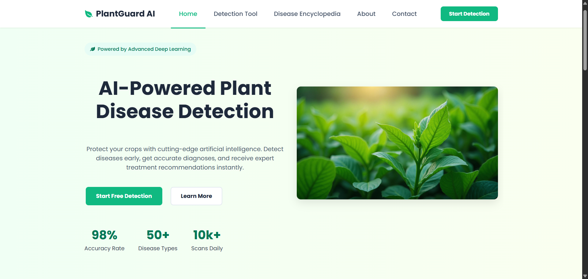
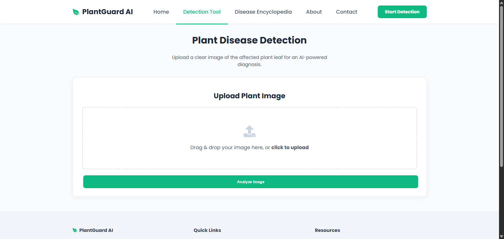
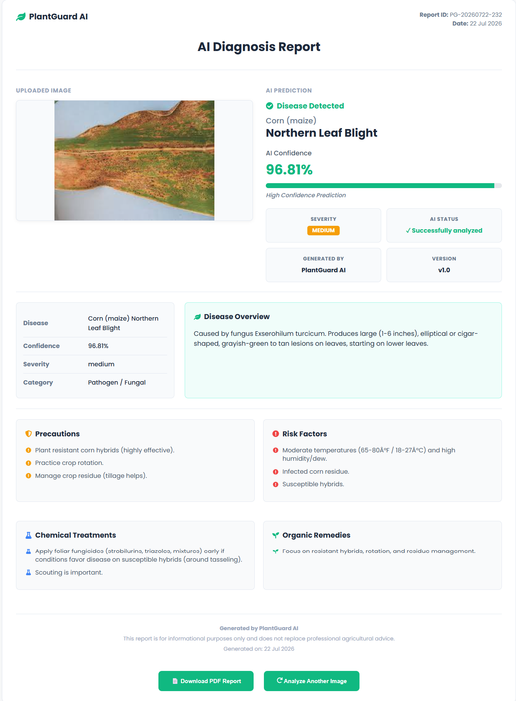
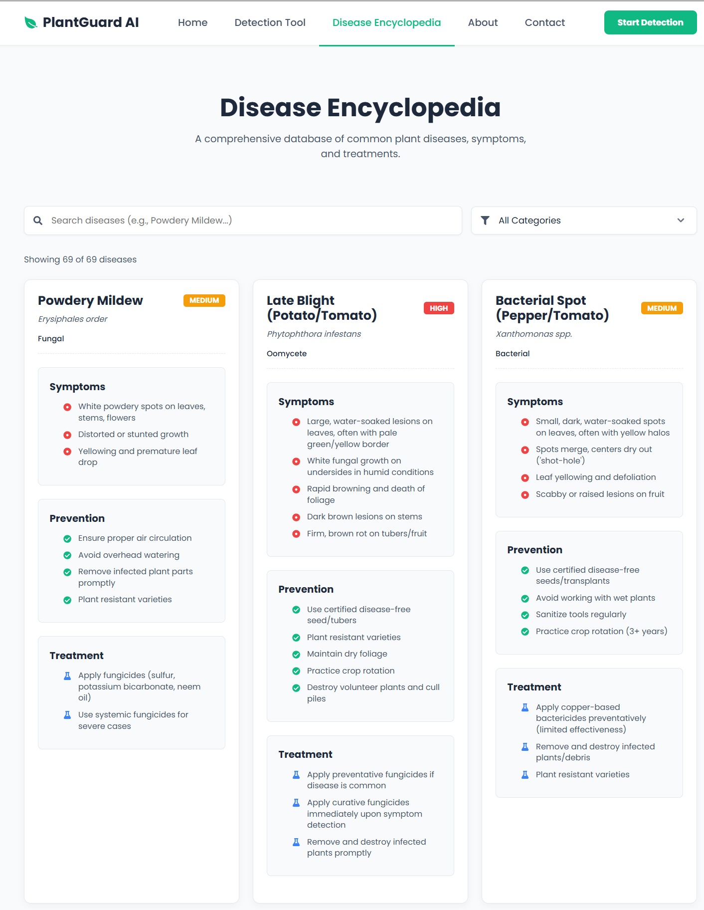
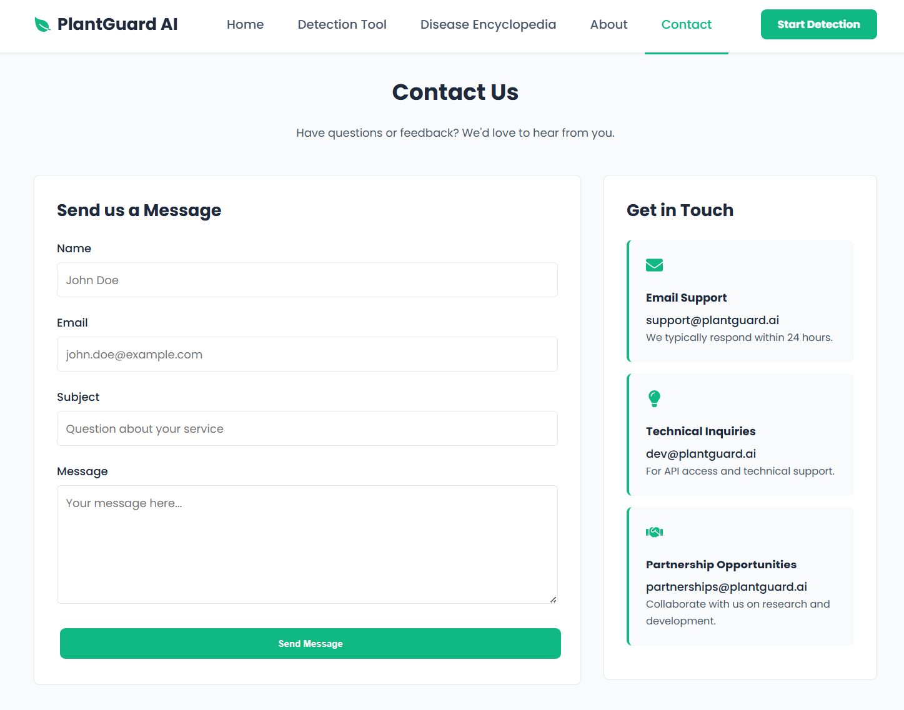
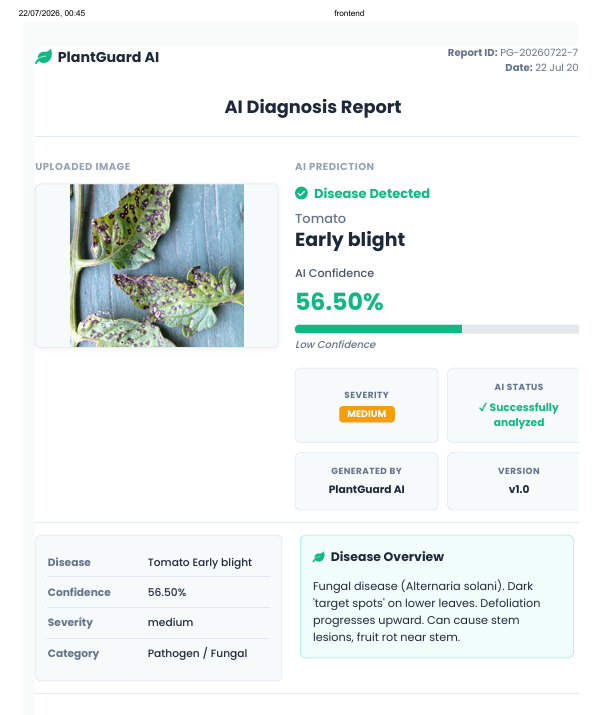
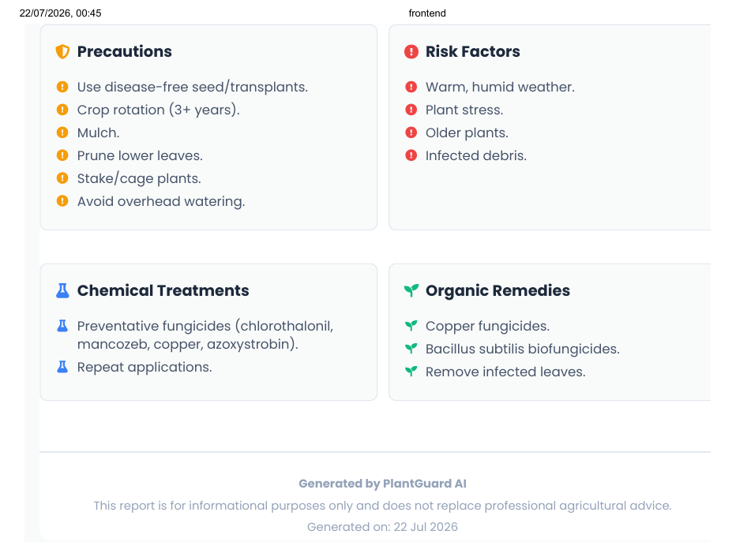
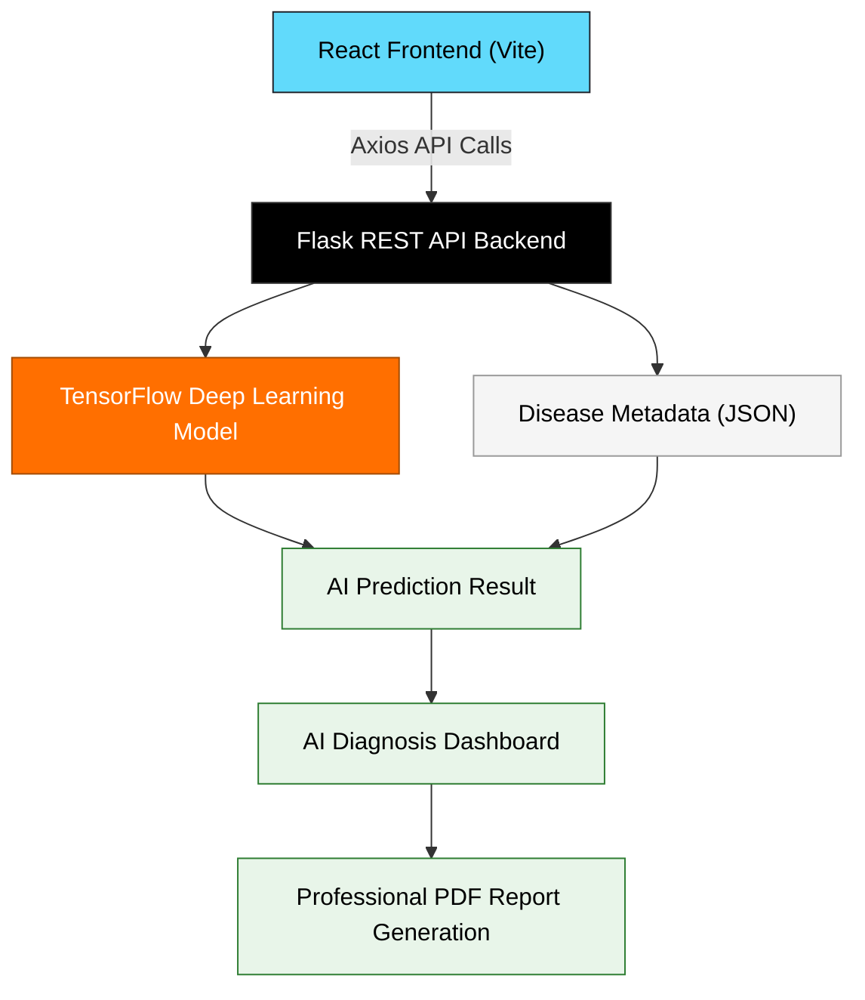
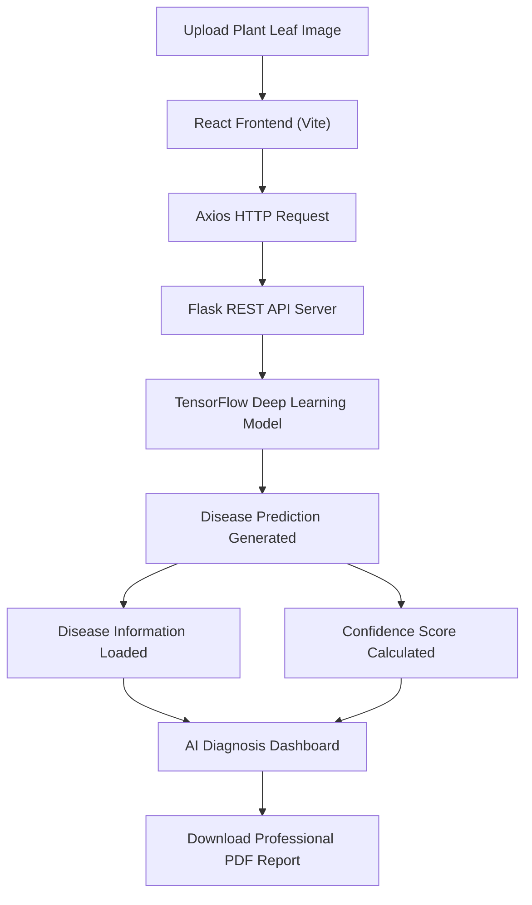
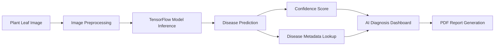

<div align="center">

# 🌿 PlantGuard AI

### AI-Powered Plant Disease Detection and Diagnosis Platform

An intelligent full-stack web application that detects plant diseases from leaf images using Deep Learning and generates comprehensive AI-powered diagnosis reports with treatment recommendations.


</div>

---

<p align="center">
  
</p>

---

## 📑 Table of Contents

- [Overview](#-overview)
- [Key Features](#-key-features)
- [Application Preview](#️-application-preview)
- [System Architecture](#-system-architecture)
- [Application Workflow](#-application-workflow)
- [Technology Stack](#️-technology-stack)
- [Project Structure](#-project-structure)
- [Project Modules](#-project-modules)
- [Installation & Setup](#️-installation--setup)
- [API Documentation](#-api-documentation)
- [Deep Learning Model](#-deep-learning-model)
- [Prediction Pipeline](#-prediction-pipeline)
- [AI Diagnosis Report](#-ai-diagnosis-report)
- [Project Highlights](#-project-highlights)
- [Future Improvements](#-future-improvements)
- [Contributing](#-contributing)
- [License](#-license)
- [Author](#-author)
- [Acknowledgements](#-acknowledgements)
- [Support](#-support)

---

## 🌿 Overview

PlantGuard AI is an AI-Powered Plant Disease Detection and Diagnosis Platform developed to assist farmers, students, researchers, and agriculture enthusiasts in identifying plant diseases quickly and accurately.

The application combines a **React frontend**, a **Flask REST API**, and a **TensorFlow Deep Learning model** to analyze uploaded plant leaf images. After prediction, the system generates an AI diagnosis dashboard containing disease information, confidence score, severity level, preventive measures, treatment recommendations, and a downloadable PDF diagnosis report.

Unlike traditional image classifiers, PlantGuard AI focuses on providing meaningful insights rather than only predicting disease names, making it more practical for educational and agricultural applications.

---

## 🌿 Key Features

- 🧠 AI-powered plant disease detection using Deep Learning
- 📷 Drag & drop image upload interface
- 🔍 TensorFlow-based disease classification
- 📊 Confidence score visualization
- 📄 Professional AI diagnosis PDF report
- 📚 Searchable disease encyclopedia
- ⚠️ Disease risk factor breakdown
- 🛡️ Prevention guidelines
- 🧪 Chemical treatment recommendations
- 🌱 Organic treatment recommendations
- ✉️ Contact form (EmailJS integration)
- 📱 Responsive, modern user interface

---

## 🖼️ Application Preview

### 🏠 Home Page

The landing page introduces PlantGuard AI with a clean modern interface, project highlights, and quick access to disease detection.

<p align="center">
  
</p>

---

### 🔍 Detection Tool

**Before Prediction** — Upload or drag-and-drop a plant leaf image for AI analysis.

<p align="center">
  
</p>

**After Prediction** — PlantGuard AI generates a detailed AI diagnosis dashboard containing the disease prediction, confidence score, severity, disease overview, treatment recommendations, and a downloadable PDF report.

<p align="center">
  
</p>

---

### 📚 Disease Encyclopedia

Browse a searchable collection of plant diseases with symptoms, prevention methods, and treatment recommendations.

<p align="center">
  
</p>

---

### ✉️ Contact Page

Users can contact the PlantGuard AI team using the integrated contact form powered by EmailJS.

<p align="center">
  
</p>

---

### 📄 AI Diagnosis PDF Report

PlantGuard AI automatically generates a professional multi-page PDF diagnosis report containing the prediction results, confidence score, disease overview, treatment recommendations, and additional report metadata.

<p align="center">
  
</p>

<p align="center">
  
</p>

---

## 🏗️ System Architecture



---

## 🔄 Application Workflow



---

## 🛠️ Technology Stack

### Frontend

| Technology | Purpose |
|------------|---------|
| React | Component-based user interface |
| Vite | Fast frontend development and build tool |
| React Router DOM | Client-side routing |
| Axios | Communication with the Flask REST API |
| React Icons | UI icons |
| CSS3 | Responsive styling and layouts |
| EmailJS | Contact form integration |

### Backend

| Technology | Purpose |
|------------|---------|
| Python | Backend programming language |
| Flask | REST API framework |
| Flask-CORS | Cross-Origin Resource Sharing |
| Pillow | Image preprocessing |
| NumPy | Numerical computations |

### Artificial Intelligence

| Technology | Purpose |
|------------|---------|
| TensorFlow | Deep learning framework |
| Keras | Model loading and inference |
| MobileNetV2 (fine-tuned) | Plant disease classification model |

### Report Generation

| Technology | Purpose |
|------------|---------|
| jsPDF | Generate downloadable PDF reports |
| html2canvas | Capture dashboard content for PDF export |

---

## 📁 Project Structure

```text
PlantGuard-AI/
│
├── backend/
│   ├── app.py
│   ├── requirements.txt
│   ├── models/
│   │   └── plant_disease_model_finetuned.h5
│   └── data/
│       ├── diseases.json
│       └── disease_info.json
│
├── frontend/
│   ├── public/
│   ├── src/
│   │   ├── assets/
│   │   ├── components/
│   │   │   ├── Home.jsx
│   │   │   ├── DetectionTool.jsx
│   │   │   ├── DiseaseEncyclopedia.jsx
│   │   │   ├── Contact.jsx
│   │   │   ├── About.jsx
│   │   │   ├── Navbar.jsx
│   │   │   ├── Footer.jsx
│   │   │   ├── Layout.jsx
│   │   │   ├── PrivacyPolicy.jsx
│   │   │   └── TermsOfService.jsx
│   │   ├── App.jsx
│   │   └── main.jsx
│   ├── package.json
│   └── vite.config.js
│
├── docs/
│   └── screenshots/
│       ├── home.png
│       ├── detection-before.png
│       ├── detection-after.png
│       ├── encyclopedia.png
│       ├── contact.png
│       ├── pdf-result-1.png
│       └── pdf-result-2.png
│
├── README.md
├── LICENSE
└── .gitignore
```

---

## 📦 Project Modules

**🏠 Home** — Introduces PlantGuard AI with an overview of the platform, project highlights, and quick navigation to disease detection.

**🔍 Detection Tool** — Allows users to upload plant leaf images, perform AI-powered disease prediction, visualize confidence scores, and generate professional PDF diagnosis reports.

**📚 Disease Encyclopedia** — Provides a searchable database of plant diseases, including symptoms, prevention strategies, and treatment recommendations.

**📄 AI Diagnosis Report** — Displays comprehensive prediction results, including disease prediction, confidence score, severity level, disease overview, prevention guidelines, risk factors, chemical treatments, and organic remedies. Users can also download the diagnosis as a professional PDF report.

**✉️ Contact** — A responsive contact page integrated with EmailJS, allowing users to submit inquiries or feedback directly from the application.

---

## ⚙️ Installation & Setup

Follow the steps below to run PlantGuard AI locally.

### 1️⃣ Clone the Repository

```bash
git clone https://github.com/dhanushgowdars/PlantGuard-AI.git
cd PlantGuard-AI
```

### 2️⃣ Backend Setup

Navigate to the backend directory.

```bash
cd backend
```

**Create a virtual environment**

Windows:
```bash
python -m venv .venv
.venv\Scripts\activate
```

Linux / macOS:
```bash
python3 -m venv .venv
source .venv/bin/activate
```

**Install Python dependencies**

```bash
pip install -r requirements.txt
```

The backend requires packages such as:
- Flask
- Flask-CORS
- TensorFlow
- Pillow
- NumPy

**Run the Flask server**

```bash
python app.py
```

The backend will start at:

```
http://localhost:5000
```

### 3️⃣ Frontend Setup

Open another terminal and navigate to the frontend folder.

```bash
cd frontend
```

**Install the required packages**

```bash
npm install
```

**Configure environment variables**

Create a `.env` file inside the `frontend` folder:

```env
VITE_API_URL=http://localhost:5000
VITE_EMAILJS_SERVICE_ID=your_service_id
VITE_EMAILJS_TEMPLATE_ID=your_template_id
VITE_EMAILJS_PUBLIC_KEY=your_public_key
```

**Start the frontend**

```bash
npm run dev
```

The application will be available at:

```
http://localhost:5173
```

---

## 🔌 API Documentation

**Base URL**

```
http://localhost:5000
```

### Predict Plant Disease

**Endpoint**

```http
POST /predict
```

**Request**

Content-Type: `multipart/form-data`

**Form Data**

| Field | Type | Description |
|--------|------|-------------|
| file | Image | Plant leaf image |

**Successful Response**

```json
{
  "prediction": "Corn (maize) Northern Leaf Blight",
  "confidence": "96.81%",
  "details": {
    "description": "...",
    "severity": "Medium",
    "precautions": [],
    "risk_factors": [],
    "treatment": {
      "chemical": [],
      "organic": []
    }
  }
}
```

**Error Response**

```json
{
  "error": "Unable to process the uploaded image."
}
```

---

## 🧠 Deep Learning Model

PlantGuard AI uses a fine-tuned **MobileNetV2** convolutional neural network for plant disease classification.

**Model Highlights**
- Fine-tuned MobileNetV2 architecture
- TensorFlow / Keras implementation
- Transfer learning approach
- Optimized for plant leaf disease classification
- Fast inference for real-time predictions

**Model Input**
- RGB plant leaf image
- Automatically preprocessed before inference

**Model Output**

The fine-tuned MobileNetV2 model classifies plant leaf images into **38 disease categories**.

For each uploaded image, the model returns:

- Predicted disease (or healthy class)
- Prediction confidence score

The Flask backend then uses the predicted class to retrieve additional disease information from the metadata database, including:

- Disease description
- Severity level
- Prevention guidelines
- Risk factors
- Chemical treatment recommendations
- Organic treatment recommendations

This information is combined to generate the AI Diagnosis Dashboard and the downloadable PDF report.

**Model File**

```
backend/models/plant_disease_model_finetuned.h5
```


The backend then enriches the prediction using the disease metadata stored in `backend/data/disease_info.json` to generate:
- Disease overview
- Severity
- Prevention guidelines
- Risk factors
- Chemical treatments
- Organic remedies

---


## 🌱 Supported Plants & Diseases

PlantGuard AI currently supports disease detection for the following crops based on the PlantVillage dataset.

| Crop | Diseases |
|------|----------|
| Apple | Apple Scab, Black Rot, Cedar Apple Rust, Healthy |
| Blueberry | Healthy |
| Cherry | Powdery Mildew, Healthy |
| Corn (Maize) | Cercospora Leaf Spot, Common Rust, Northern Leaf Blight, Healthy |
| Grape | Black Rot, Esca (Black Measles), Leaf Blight, Healthy |
| Orange | Citrus Greening |
| Peach | Bacterial Spot, Healthy |
| Pepper (Bell) | Bacterial Spot, Healthy |
| Potato | Early Blight, Late Blight, Healthy |
| Raspberry | Healthy |
| Soybean | Healthy |
| Squash | Powdery Mildew |
| Strawberry | Leaf Scorch, Healthy |
| Tomato | Bacterial Spot, Early Blight, Late Blight, Leaf Mold, Septoria Leaf Spot, Spider Mites, Target Spot, Mosaic Virus, Yellow Leaf Curl Virus, Healthy |

**Total Classes:** 38

---

## 📂 Dataset

The deep learning model was trained using the **PlantVillage Dataset**, a publicly available dataset containing labeled images of healthy and diseased plant leaves.

**Dataset Source:**

https://www.kaggle.com/datasets/abdallahalidev/plantvillage-dataset

The dataset was used for educational and research purposes to train and evaluate the plant disease classification model.

---


## 📊 Prediction Pipeline



---

## 📄 AI Diagnosis Report

PlantGuard AI automatically generates a professional PDF report after each successful prediction.

The report includes:
- Uploaded plant image
- Predicted disease
- Confidence score
- Severity level
- Disease overview
- Prevention guidelines
- Risk factors
- Chemical treatments
- Organic remedies
- Report metadata (date & report ID)

The generated multi-page PDF report can be downloaded and shared for educational purposes, documentation, or future reference.

---

## 🌟 Project Highlights

- Built a complete full-stack AI application using **React**, **Flask**, and **TensorFlow**.
- Implemented an end-to-end image classification workflow from upload to prediction.
- Designed a responsive user interface with a modern AI diagnosis dashboard.
- Integrated disease metadata to provide meaningful recommendations beyond simple classification.
- Added professional PDF report generation for prediction results.
- Organized the project with separate frontend, backend, and documentation modules.

---

## 🚀 Future Improvements

Potential enhancements for future versions include:

- 📷 Live camera-based disease detection
- 🌐 Multi-language support
- ☁️ Cloud deployment
- 📱 Mobile application
- 🌾 Support for additional crops and diseases
- 📈 Continuous model improvement with larger datasets

---

## 🤝 Contributing

Contributions are welcome! If you would like to improve PlantGuard AI:

1. Fork the repository.
2. Create a new feature branch.
   ```bash
   git checkout -b feature/your-feature-name
   ```
3. Commit your changes.
   ```bash
   git commit -m "Add your feature"
   ```
4. Push to your branch.
   ```bash
   git push origin feature/your-feature-name
   ```
5. Open a Pull Request.

---

## 📜 License

This project is licensed under the **MIT License**. See the [LICENSE](LICENSE) file for more information.

---

## 👨‍💻 Author

**Dhanush R S**
Computer Science Engineering (Data Science)

PlantGuard AI was designed and developed as a full-stack AI application to demonstrate practical skills in machine learning, computer vision, backend development, and modern web technologies.

**GitHub:** [https://github.com/dhanushgowdars](https://github.com/dhanushgowdars)

If you have any suggestions or feedback, feel free to open an issue or connect through GitHub.

---

## 🙏 Acknowledgements

Special thanks to the open-source community and the developers behind React, Flask, TensorFlow, Keras, Vite, and EmailJS for providing the tools and frameworks that made this project possible.

---

<div align="center">

## ⭐ Support

If you found this project useful, please consider giving it a ⭐ on GitHub.
It helps others discover the project and supports future improvements.

**Thank you for visiting PlantGuard AI! 🌿**

</div>
